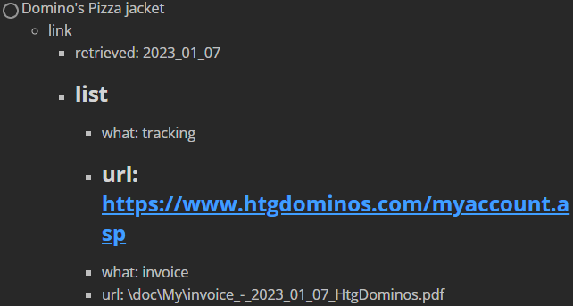

# I wish

- [ ] the node delimiter ':' would have an escape sequence

- [ ] an action item could tell me in schedule view whether or not it has an unfinished todo-list

- [ ] I could identify and interact with the checkboxes that appear in markdown action items

- [ ] ``Get-MarkdownTable``
  - actual
    ```powershell
    > (cat example.md | Get-MarkdownTable).list.list_subitem

    when       what
    ----       ----
    2023_01_05 sus
    2023_01_06 ihr
    2023_01_07 oth
    ```
  - expected
    ```powershell
    > cat example.md | Get-MarkdownTable

    when       what
    ----       ----
    2023_01_05 sus
    2023_01_06 ihr
    2023_01_07 oth
    ```

- [ ] I could identify expired action items
  
  - and have the option
    - to remove them
    - or to move them to an archive or ignored folder

- [ ] I could see expired action items from earlier today

- [ ] I could see high-priority deadlines within a week or month's notice but low-priority deadlines within a day's notice

- [ ] 2022_11_09_175458
  
  - I could write action items in list form under a single ``sched`` heading, using the ``what`` field as the title
    
    - example
      
      - typical form
        
        ```
        # sched
        - what: read
        - when: mon-1800
        - every: week
        - type: routine
        
        # sched
        - what: write
        - when: tue-1800
        - every: week
        - type: routine
        ```
      
      - new form
        
        ```
        # sched
        - read
          - when: mon-1800
          - every: week
          - type: routine
        - write
          - when: tue-1800
          - every: week
          - type: routine
        ```

- [x] I could schedule an action item for the same time every monday, friday, and saturday
  
  - solution
    
    - refactor: ``every' = every union 2^(Mon + Tue + Wed + ... + Sun)``
      
      ```
      example
          every: Mon, Tue, Wed, Fri
      thus
          every = (Mon: (0|1), Tue: (0|1), ... Sun: (0|1))
          every = (2, 2, 2, 2, 2, 2, 2)
          every = 2^7
          every = 2^(Mon + Tue + Wed + ... + Sun)
      ```
    
    - example
      
      ```
      # sched
      - what: college development course
      - when: 1000
      - every: Mon, Wed, Fri
      - type: routine
      ```
      
      - above is equivalent to
      
      ```
      # sched
      - what: college development course
      - when: mon-1000
      - every: week
      - type: routine
      
      # sched
      - what: college development course
      - when: wed-1000
      - every: week
      - type: routine
      
      # sched
      - what: college development course
      - when: fri-1000
      - every: week
      - type: routine
      ```

- [x] I wish I could access an action item's file by selecting from a numbered list
  
  - karlr: Why not just use 'sls' or 'grep'?
  - solution: C:\shortcut\bin\schedsearch.bat

- [x] I could parse text rendered by the ``Write-*`` cmdlets but still see different-colored text

- [x] I could see today's work schedule

# issue

- [ ] 2023_01_11_173519
  - howto
    - in powershell
      ```powershell
      Get-MySchedule -Subdirectory homework -StartDate 2023_01_09
      ```
    - in ``sched.md``
      ```
      # sched
      - what
        - recite Philippians
      - every: mon
      - type: todayonly
      ```
  - actual
    ```
    Monday (2023_01_09)
    -------------------
    23:00      Change and Growth Plan
    23:00      @{recite Philippians=}
    ```
  - expected
    ```
    Monday (2023_01_09)
    -------------------
    23:00      Change and Growth Plan
    23:00      recite Philippians
    ```

- [ ] 2023_01_11_170506

  - actual
    - ``todo.md`` in neovim
      ```
      - [ ] Domino's Pizza jacket
        - link
          - retrieved: 2023_01_07
          - list
            - 
              - what: tracking
              - url: https://www.htgdominos.com/myaccount.asp
            - 
              - what: invoice
              - url: \doc\My\invoice_-_2023_01_07_HtgDominos.pdf
      ```
    - ``todo.md`` in MarkText
  


- [ ] 2023_01_10_230005
  - howto
    - in powershell
      ```powershell
      $tree = cat .\todo_-_2022_12_16.md | Get-MarkdownTable
      $tree.lookup | Write-MarkdownTree
      ```
    - in ``todo_-_2022_12_16.md``
      ```
      # lookup
      - howto: tie shoes efficiently
        - [ ] learn
        - [x] find
          - link
            - search
              - How To Tie Your Shoes Insanely Fast!
              - SharpshooterJD
              - YouTube
            - retrieved: 2023_01_10
      - howto: remove windshield glare
        - [ ] learn
        - [x] find
          - link
            - search
              - STOP Auto Glass GLARE & WATER SPOTS....FOREVER!!!!!
              - Sweet Project Cars
              - YouTube
            - retrieved: 2023_01_10
      - [ ] learn: webassembly
        - [ ] link video in listen-later playlist
      - [ ] learn: Hindley-Milner type system
      ```
  - actual
    ```
    - howto
      - tie shoes efficiently
      - remove windshield glare
    - [ ] learn
      - webassembly
      - Hindley-Milner type system
    ```
  - expected
    ```
    - howto
      - tie shoes efficiently
        - [ ] learn
        - [x] find
          - link
            - search
              - How To Tie Your Shoes Insanely Fast!
              - SharpshooterJD
              - YouTube
            - retrieved: 2023_01_10
      - remove windshield glare
        - [ ] learn
        - [x] find
          - link
            - search
              - STOP Auto Glass GLARE & WATER SPOTS....FOREVER!!!!!
              - Sweet Project Cars
              - YouTube
            - retrieved: 2023_01_10
    - learn
      - [ ] webassembly
        - [ ] link video in listen-later playlist
      - [ ] Hindley-Milner type system
    ```

- [ ] 2022_10_27_180542
  - actual
    - action items with header levels other than 3 are ignored

- [x] 2023_01_02_224101
  - howto
    ```powershell
    Find-MyTree -Subdirectory request -Tag coworker
    ```
  - actual
    ```
    - @{sus=; ihr=; oth=}
      - when
        - never
      - tag
        - susihroth
    ```
  - expected
    ```
    - sus
      - when
        - never
      - tag
        - susihroth
    - ihr
      - when
        - never
      - tag
        - susihroth
    - oth
      - when
        - never
      - tag
        - susihroth
    ```

- [x] 2022_11_10_003045
  - howto
    ```
    \shortcut\bin\tagsearch.bat request self
    ```
  - actual
    ```
    The property 'Name' cannot be found on this object. Verify that the
    property exists.
    At C:\Users\karlr\OneDrive\Documents\devlib\powershell\PsSchedule\script
    \ScheduleObject.ps1:407 char:21
    +                 if ($Name -in $properties.Name) {
    +                     ~~~~~~~~~~~~~~~~~~~~~~~~~~
        + CategoryInfo          : NotSpecified: (:) [], PropertyNotFoundExc
       eption
        + FullyQualifiedErrorId : PropertyNotFoundStrict
    
    The property 'Name' cannot be found on this object. Verify that the
    property exists.
    At C:\Users\karlr\OneDrive\Documents\devlib\powershell\PsSchedule\script
    \ScheduleObject.ps1:407 char:21
    +                 if ($Name -in $properties.Name) {
    +                     ~~~~~~~~~~~~~~~~~~~~~~~~~~
        + CategoryInfo          : NotSpecified: (:) [], PropertyNotFoundExc
       eption
        + FullyQualifiedErrorId : PropertyNotFoundStrict
    
    - tag
      - self
    - what
      - a safe means to use a device in the vicinity of a high-bandwidth ISP
    - tag
      - self, team evangelism
    - what
      - excitement for the gospel
      - boldness to speak
      - right words to say
    - what
      - request
      - that I can learn how to evangelize
      - that I can learn how to learn how to evangelize
    - tag
      - self
    ```
  
  - expected
    
    ```
    - tag
      - self
    - what
      - a safe means to use a device in the vicinity of a high-bandwidth ISP
    - tag
      - self, team evangelism
    - what
      - excitement for the gospel
      - boldness to speak
      - right words to say
    - tag
      - self
    - what
      - that I can learn how to evangelize
      - that I can learn how to learn how to evangelize
    ```
  
  - cause
    
    - the latest refactor to accomodate the new tree form
      - as in ``"I wish" 2022_11_09_175458``
      - messes up trees at Level 2 that don't have inline branches

- [x] 2022_11_08_125240
  
  - solution: non-issue
  - howto
    - in ``sched.md``
      
      ```
      # sched
      - what: Amazon delivery
      - when
        - [ ] 2022_11_02_1000
      - type: todo
      - every: none
      ```
    - cmd
      
      ```
      \shortcut\bin\sched.bat
      ```
  - actual
    
    ```
    Tuesday (2022_11_08)
    --------------------
    00:01      Amazon delivery
    ```
  - expected
    
    ```
    Tuesday (2022_11_08)
    --------------------
    10:00      Amazon delivery
    ```

- [x] 2022_11_06_114157
  
  - howto
    ``Get-MarkdownTable``
  - actual
    
    ```
    ...
    @{when=11/10/2022 18:30:00; what=Homegroup Bible Study; who:=; where=; type=event}
    ...
    ```
  - expected
    
    ```
    ...
    @{when=11/10/2022 18:30:00; what=Homegroup Bible Study; who=; where=; type=event}
    ...
    ```

- [x] 2022_11_05_140003
  
  - actual
    - ``todo`` items are treated as one-day events
  - expected
    - ``todo`` items are treated as action items to be completed, starting at ``when``

- [x] 2022_11_03_150245
  
  - actual
    
    ```
    C:\Users\karlr> sched.bat -subdir request
    
    Thursday (2022_11_03)
    ---------------------
    22:00      friend
    22:00      workplace
    22:00      cbcmbs
    22:00      self
    22:00      church
    22:00      team evangelism
    22:00      coworkers
    22:00      leaders
    ```
  
  - cause
    
    - ``script\ScheduleObject.ps1:919-920``
      
      ```powershell
      switch -Regex ($schedEvery) {
          '\w+(\s*,\s*\w+)+' {
      ```
  
  - solution
    
    ```powershell
    switch -Regex ($schedEvery) {
        '\w+(\s*,\s*\w+)*' {
    ```

- [x] 2022_10_26_170128
  
  - howto
    ``C:\shortcut\bin\sched.bat``
  
  - actual
    
    ```
    Add-Member : Cannot add a member with the name "retrieved" because a member with
    that name already exists. To overwrite the member anyway, add the Force parameter
    to your command.
    At C:\Users\karlr\OneDrive\Documents\devlib\powershell\PsSchedule\script\ScheduleOb
    ject.ps1:458 char:23
    +             $parent | Add-Member `
    +                       ~~~~~~~~~~~~
        + CategoryInfo          : InvalidOperation: (@{sched=System....ved=2022_10_09}
       :PSObject) [Add-Member], InvalidOperationException
        + FullyQualifiedErrorId : MemberAlreadyExists,Microsoft.PowerShell.Commands.Ad
       dMemberCommand
    
    The property 'sched' cannot be found on this object. Verify that the property
    exists.
    At C:\Users\karlr\OneDrive\Documents\devlib\powershell\PsSchedule\script\ScheduleOb
    ject.ps1:211 char:24
    +                 return $what.sched `
    +                        ~~~~~~~~~~~~~
        + CategoryInfo          : NotSpecified: (:) [], PropertyNotFoundException
        + FullyQualifiedErrorId : PropertyNotFoundStrict
    ```
  
  - cause
    
    1. Line 454: failure to use proper binding: ``$content``
    2. Line 211: failure to account for failable return value from ``Get-MarkdownTable``

- [x] 2022_10_21_121845
  
  - howto
    ``C:\shortcut\bin\sched.bat``
  - actual
    
    ```
    Add-Member : Cannot add a member with the name "https" because a member with that
    name already exists. To overwrite the member anyway, add the Force parameter to
    your command.
    At C:\Users\karlr\OneDrive\Documents\devlib\powershell\PsSchedule\script\ScheduleOb
    ject.ps1:445 char:23
    +             $parent | Add-Member `
    +                       ~~~~~~~~~~~~
        + CategoryInfo          : InvalidOperation: (@{https=//revol...om/goto/giving}
       :PSObject) [Add-Member], InvalidOperationException
        + FullyQualifiedErrorId : MemberAlreadyExists,Microsoft.PowerShell.Commands.Ad
       dMemberCommand
    ```
  - cause
    In a schedule file:
    
    ```
    - url
      - https://revolvebiblechurch.ccbchurch.com/goto/giving
      - https://pushpay.com/g/compasschurch?r=weekly&src=hpp
    ```
    
    Web links are being parsed like node names.
  - solution
    - require inline branches to be spaced:
      - accepted
        ``- what: daily todo``
      - not accepted
        ``- what:daily todo``
